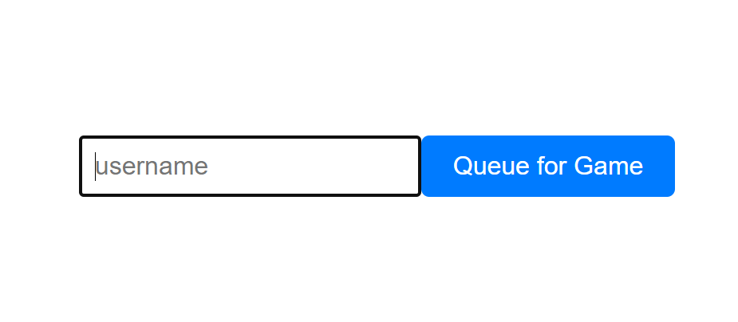
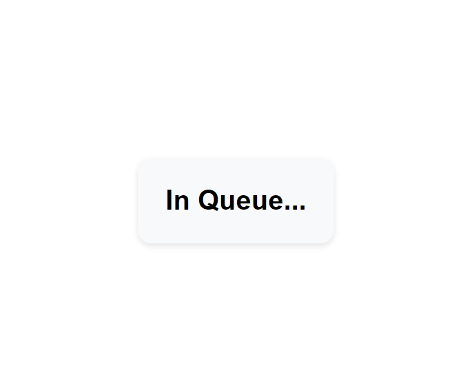
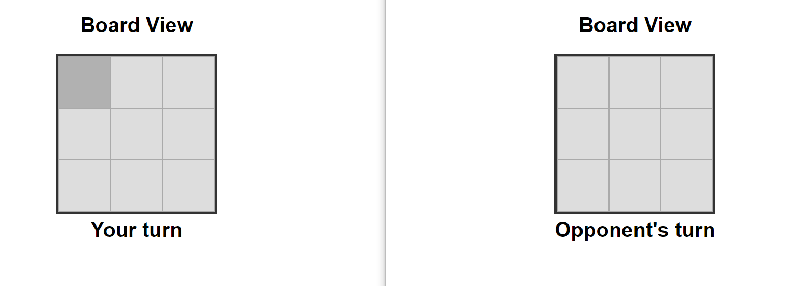
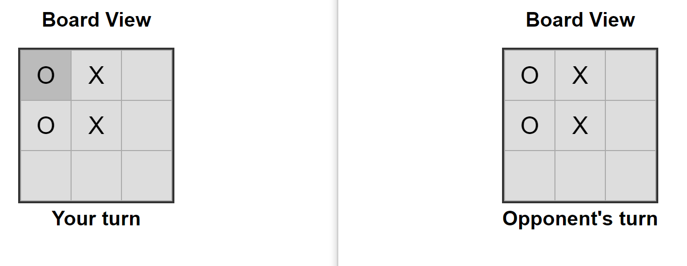
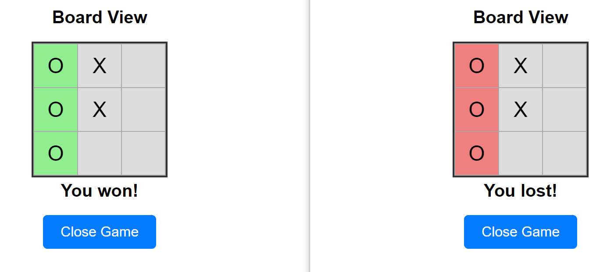
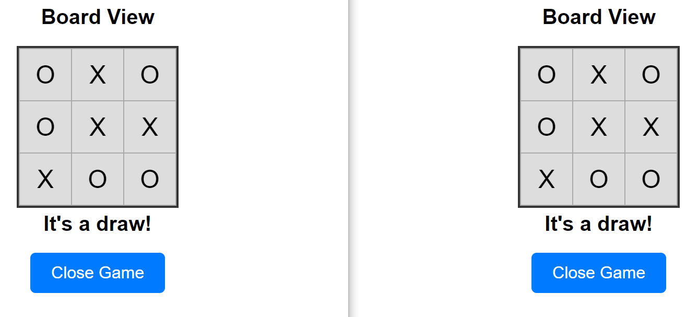

PROJECT IS STILL UNDER DEVELOPMENT!

# Web Tic Tac Toe

Web application of TicTacToe game between 2 players.

Library part of TicTacToe can be found here: https://github.com/DominikSzczesniak/TicTacToe

## General Information
This part of the project is released as a web app that utilizes previously made by me external library.
The idea of this application is to challenge myself to use a suboptimal dependency that contains business rules and 
deal with the problems that arise as best as I can.
The project also served me as an opportunity to learn front-end technologies.

## Technologies Used
- Java - version 17.0.5
- Maven
- GIT
- Spring Boot
- JUnit
- React
- JavaScript

## Features
- queueing up for a game
- making moves
- closing the game

# Illustration
## Before the game

## During the game

